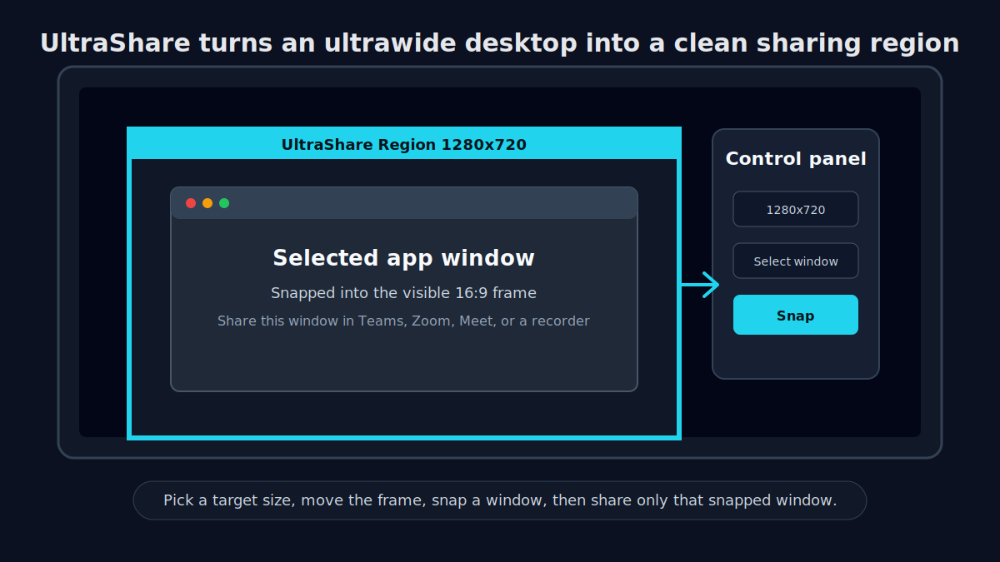

# UltraShare

UltraShare is a Windows desktop utility for sharing a clean standard-size region from an ultrawide monitor.

It helps presenters, streamers, teachers, and remote workers avoid black bars, tiny shared content, and awkward 21:9 or 32:9 screen-sharing layouts. The app creates a visible overlay region, snaps a selected window into that region, and keeps the shared window aligned while you work.

## Workflow Preview



## Why It Exists

Ultrawide monitors are great for productivity, but they often look bad in video calls and recordings. When you share the whole screen, viewers may see large black bars or content that is too small to read.

UltraShare lets you prepare a 16:9-friendly workspace on top of your ultrawide desktop, then share only the window that has been snapped into that area.

## Use Cases

- Microsoft Teams, Zoom, or Google Meet presentations from an ultrawide monitor.
- Tutorial and demo recordings in standard 720p or 1080p layouts.
- Cleaner screen sharing for viewers on laptops or normal 16:9 displays.
- Keeping a selected app window aligned with a visible presentation frame.

## Features

- Persistent always-on-top overlay frame for the sharing area.
- Smart Snap to fit a selected window into the overlay region.
- Smart Move to keep the snapped window attached when the frame moves.
- Automatic unlinking when the target window is moved manually.
- Resolution presets such as 1280x720 and 1920x1080.
- Dark desktop UI built with CustomTkinter.

## Requirements

- Windows 10 or Windows 11.
- Python 3.10 or newer.
- Win32 desktop APIs through `pywin32`.
- Python dependencies listed in `requirements.txt`:
  - `customtkinter`
  - `pywin32`
  - `pillow`
  - `keyboard`
  - `mouse`

## Installation

Clone the repository:

```bash
git clone https://github.com/AlexMnrs/UltraShare.git
cd UltraShare
```

Create and activate a virtual environment:

```powershell
python -m venv .venv
.\.venv\Scripts\Activate.ps1
```

Install dependencies:

```powershell
pip install -r requirements.txt
```

## Usage

Run the app from source:

```powershell
python main.py
```

Basic workflow:

1. Choose a target size in the control panel, such as `Teams Optimized (1280x720)`.
2. Move the overlay frame to the area you want to use for sharing.
3. Select the application window you want to present.
4. Use Snap to fit that window into the overlay region.
5. In your meeting or recording app, share the snapped application window.

## Windows Executable

UltraShare does not have an official downloadable release yet. A PyInstaller build path is documented in [docs/packaging.md](docs/packaging.md), and the repository includes a manual GitHub Actions workflow for building `UltraShare.exe` on Windows.

Until a release artifact is published, the recommended path is to run the app from source.

## Notes

- Some elevated applications may require UltraShare to run as administrator before their windows can be moved.
- Multi-monitor setups work best when UltraShare is started on the monitor where the sharing region will be used.
- UltraShare is currently intended for local Windows desktop use, not browser-based screen sharing by itself.

## Contributing

Focused improvements are welcome. See [CONTRIBUTING.md](CONTRIBUTING.md) for setup steps, manual testing notes, and pull request guidelines.

## Roadmap

Possible next improvements:

- Add real app screenshots or a short demo GIF.
- Document known limitations for multi-monitor setups.
- Publish a tested packaged release for users who do not want to run from source.
- Add basic smoke checks for startup and window detection.

## License

This project is released under the MIT License. See [LICENSE](LICENSE) for details.
